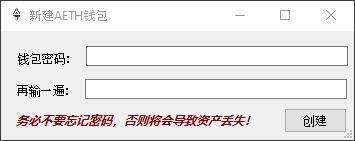
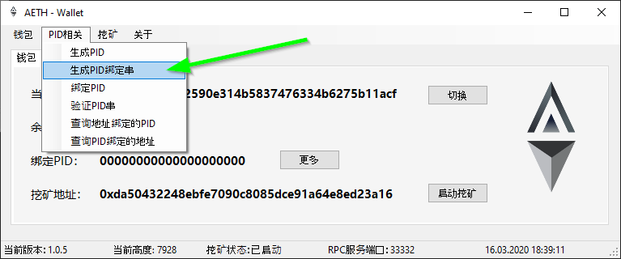
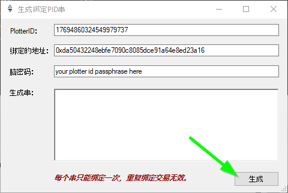
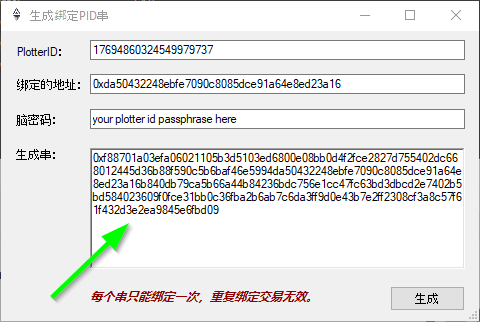
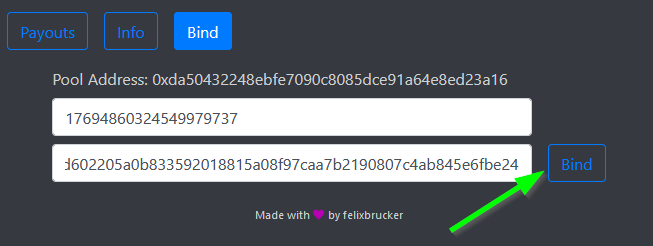

### To bind to the AETH Foxy-Pool just follow these steps:

1. Start the AETH full node (aeth.exe) and let is sync till till it is on the current height.
2. Open the AETH GUI and create an account by entering a wallet password of your choice twice:

    

3. Click the "PID" dropdown at the top and select the second entry:

    

4. Enter your plotterId into the first field.
5. Enter the pools address into the second field.
6. Enter your plotterId passphrase into the third field.

    

7. Click the button at the bottom right.
8. Your bind data is now displayed and you can copy it.

    

9. Open the [Foxy-Pool AETH Web UI](https://aeth.foxypool.cf/bind) and enter your plotterId and the copied bind data.
10. Press the `Bind` button.

    

