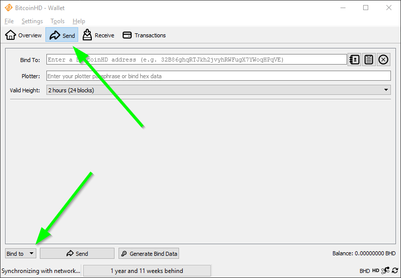
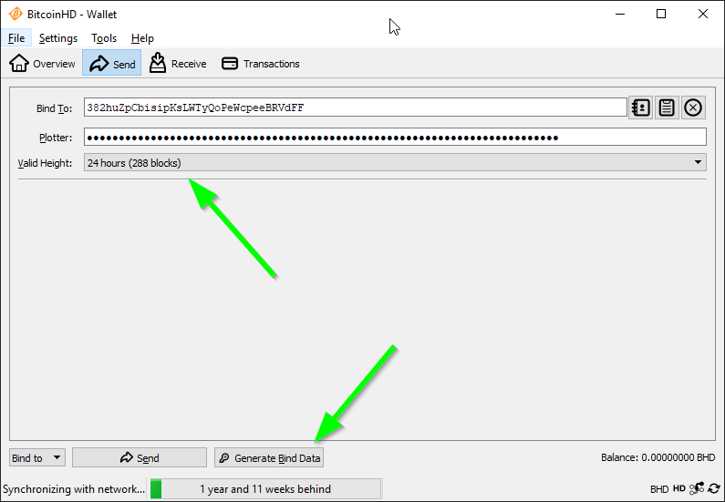
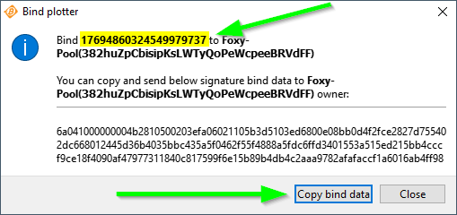
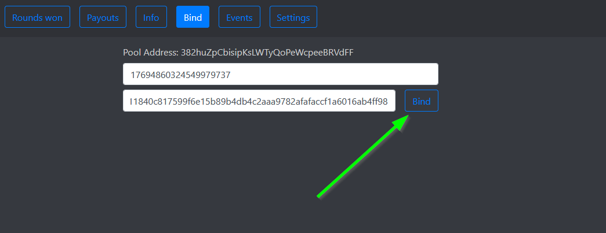

### To bind to the BHD Foxy-Pool just follow these steps:

1. Open your BHD wallet and let it sync till it is on the current
   height.
2. Change into the tab `Send` and select `Bind to`:

    {: loading=lazy }

3. Enter the pools address into the `Bind To` field.
4. Enter your plotterId passphrase into the `Plotter` field.
5. Change the `Alive Time` to 24 hours (480 blocks).

    {: loading=lazy }

6. Click on `Check` button.
7. Your plotterId and bind data are displayed. Please verify the displayed plotterId matches yours. You can copy the bind
   data with the `Copy bind data` button.

    {: loading=lazy }

8. Open the [Foxy-Pool BHD Web UI](https://bhd.foxypool.io/bind) and
   enter your plotterId and the copied bind data.
9. Press the `Bind` button.

    {: loading=lazy }
