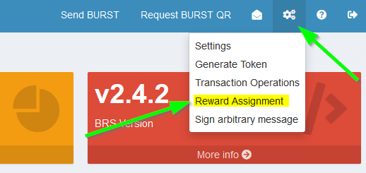

### To bind to the BURST Foxy-Pool just follow these steps:

1. Open your BURST wallet and let it sync till it is on the current
   height.
2. If you do not own any BURST, you can use the faucet available on the [pools Web UI](https://burst.foxypool.io/faucet) to get a little BURST to be able to bind to the pool.
3. Select the Setting drop down at the top right corner and click `Reward Assignment`:

    

3. In the modal appearing enter the pools address to bind to in the `recipient` field.
4. Use the minimum fee (0.00735 BURST) or if you already have enough BURST you can use a higher fee for faster confirms as well.
5. Enter your plotterId passphrase in the `passphrase` field.

    

5. Confirm the Binding via the `Set Reward Recipient` button.
