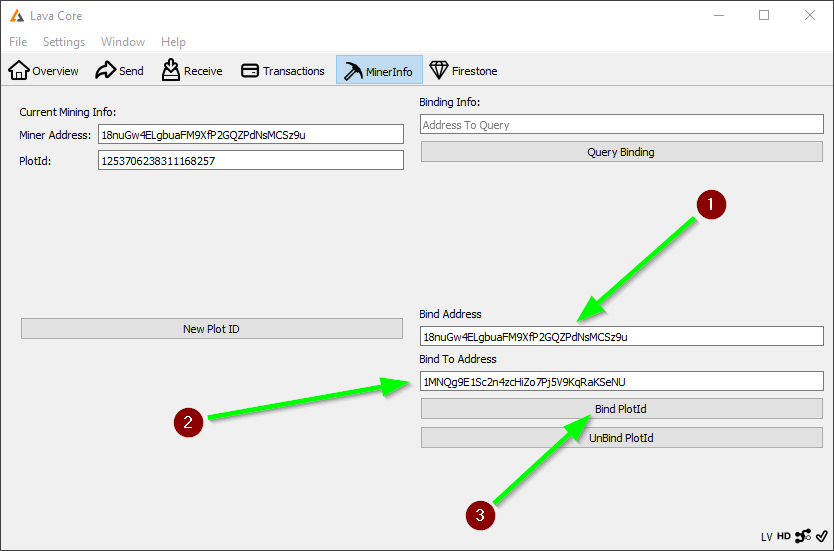

### To bind to the LAVA Foxy-Pool just follow these steps:

!!! note
    LAVA requires a LAVA only PlotId, it can not be mined together with BHD/BURST etc.

1. Open your LAVA wallet and let it sync till it is on the current
   height.
2. If you do not own any LAVA, contact `felixbrucker` on [Discord](https://discord.gg/gNHhn9y) to get 16.01 LAVA to be able to bind to the pool.
3. Change into the tab `MinerInfo` and input the pools wallet address as well as your miner address into the `Bind` form:

    

3. Enter your miner address, the address derived from your LAVA PlotterId, into the first field.
4. Enter the pools address into the second field.
5. Confirm the Binding via the `Bind PlotId` button.

