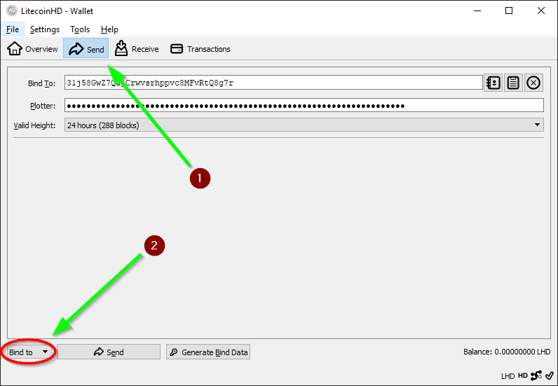
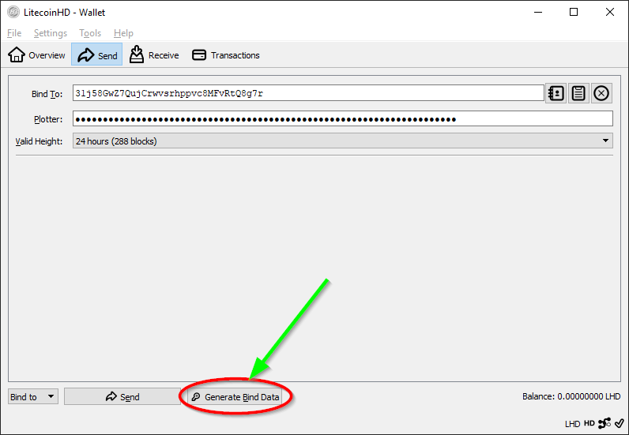
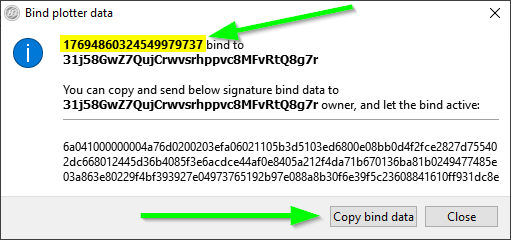
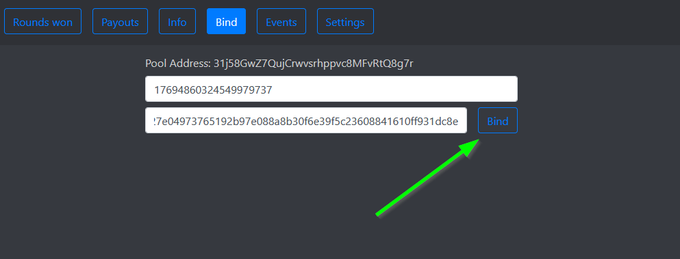

### To bind to the LHD Foxy-Pool just follow these steps:

1. Open your LHD wallet and let it sync till it is on the current
   height.
2. Change into the tab `Send` and select `Bind to`:

    

3. Enter the pools address into the `Bind To` field.
4. Enter your plotterId passphrase into the `Plotter` field.
5. Change the `Valid Height` to 24 hours (288 blocks).

    

6. Click on `Generate Bind Data` button.
7. Your plotterId and bind data are displayed. Please verify the displayed plotterId matches yours. You can copy the bind
      data with the `Copy bind data` button.

    

8. Open the [Foxy-Pool LHD Web UI](https://lhd.foxypool.cf/bind) and
   enter your plotterId and the copied bind data.
9. Press the `Bind` button.

    
