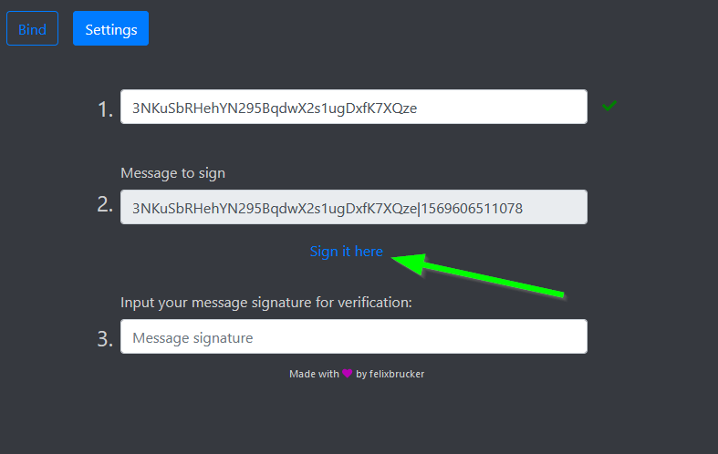
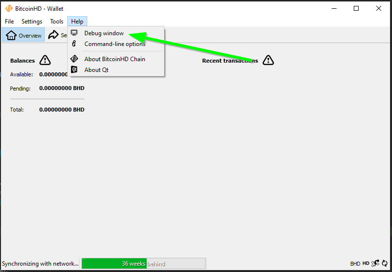
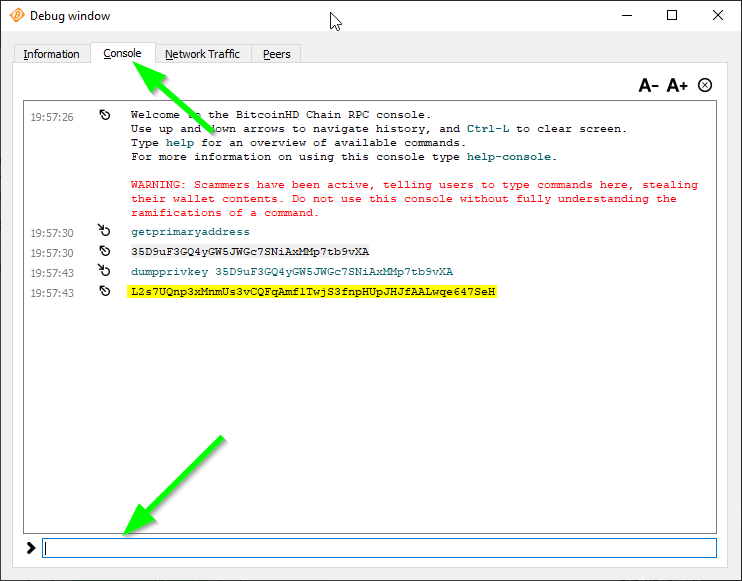
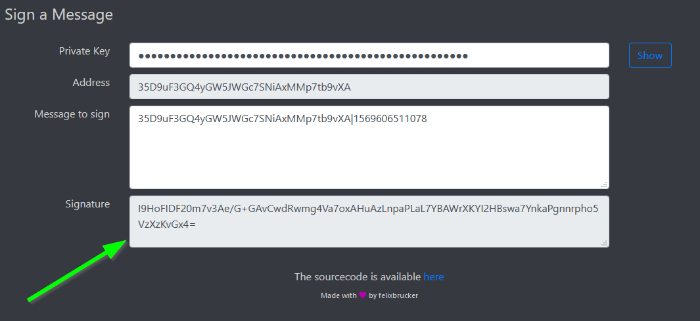
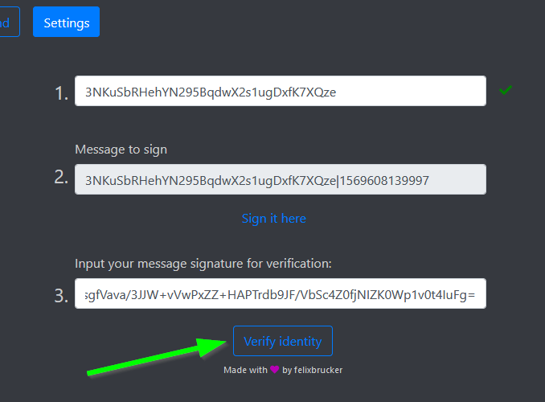

## The Settings tab

Foxy-Pools have a settings tab present, where you can create manual withdraws, change the miner name (useful for investor only miners) and turn on blocks won notifications.

To be able to access these settings you need to "log in" with your payout address you want to manage first.
This requires you to verify you do indeed own the address by signing a message with the addresses private key.

!!! warning
    Never expose your private key / passphrase to others as with it they can withdraw your funds from your wallet.

## Logging in

1. Enter your payout address that you want to manage.

    

2. Sign the message either directly in your wallet or via the signing Web-App available on [signing.foxypool.cf](https://signing.foxypool.cf).
The Web-App's sourcecode is available [here](https://github.com/felixbrucker/poc-message-signing) and can be downloaded and executed locally without internet access.
This Guide assumes the usage of the signing Web-App.

3. Retrieve your addresses private key via your wallet if wanting to sign in using BHD/BTB/DISC/LHD/HDD/XHD.
First navigate to the wallets `Console`:

    

4. Retrieve the private key via the `dumpprivkey` command followed by your address.

    

5. Input your private key or passphrase (depending on the coin) into the signing Web-App:

    

6. Copy the signature (and public key for BURST/BOOM) and paste them into the pools corresponding fields in the settings tab login form:

    

7. Login in by clicking the `Verify identity` button.
