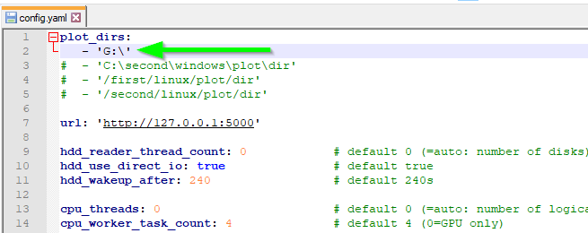

### So you want to start mining with your HDD?

1. First check your estimated rewards for the capacity you wish to use [here](https://calculator.foxypool.io). If those look good to you move on to step 2.
2. Now you need to create your first [Plot file](glossary.md#plot-file). The plot file is created using a Plotter, a piece of software which generates the [nonces](glossary.md#nonce) for the plot file using your CPU or preferably your GPU.
Recommended Plotter:
    - [Turbo Plotter](https://blackpawn.com/tp/) (Windows, Linux & Mac OS X - requires a GUI to run, easy to use)
    - [Engraver](https://github.com/PoC-Consortium/engraver/releases) (Windows & Linux - can run headless, for more advanced users)

    For this tutorial Turbo Plotter is used.

3. A Plot file contains a unique id, the [Plotter Id](glossary.md#plotter-id), also referred to as [Account Id](glossary.md#account-id). To obtain your Plotter Id please visit either your own BURST wallet or an [online wallet](https://wallet1.burst-team.us:2083/index.html) you trust and click on "New? Create Your Account!":
    {: loading=lazy }

    A secret phrase is generated for you, please store it in a secure location and make a backup!

    !!! info
        This secret phrase is directly related to the Plotter Id, without the secret phrase the Plot files for this Plotter Id can not be used correctly for mining.

4. Once you have the secret phrase backed up and confirmed, the BURST wallet dashboard is visible, where you can retrieve the Plotter Id by clicking on the BURST address in the top left corner and selecting "Copy Numeric Account ID":
    {: loading=lazy }

5. Paste your Plotter Id into Turbo Plotter and click "OK":
    {: loading=lazy }

6. Now make sure to select your GPU for plotting, add your HDD to the "Target disk path" and ensure "Max file size" is as high as possible, keep everything else on default:
    {: loading=lazy }

    !!! info
        Having more RAM can improve plotting speed dramatically.

7. Once you started the plotting you can observe its progress and estimated time till it is done plotting:
    {: loading=lazy }

8. While the Plot file is plotting, you can bind your Plotter Id to the pools. You can follow the binding guides for [BHD](../foxy-pool/binding/bhd.md) and [BURST](../foxy-pool/binding/burst.md) to do so.
9. You'll also need a [miner](glossary.md#mining-software), a piece of software reading your Plot files each round and submitting [deadlines](glossary.md#deadline) it finds in your Plot file to the pool.
   There are a number of supported and recommended mining software's listed [here](../foxy-pool/mining.md), but to get started using [Foxy-Miner](../foxy-miner/index.md) is recommended.
10. Once the Plot file is done plotting, add its path to your miner's plot file list in it's configuration file and start mining!
    {: loading=lazy }
11. To plot additional drives just repeat steps 6, 7 and 10 with the new drive paths
