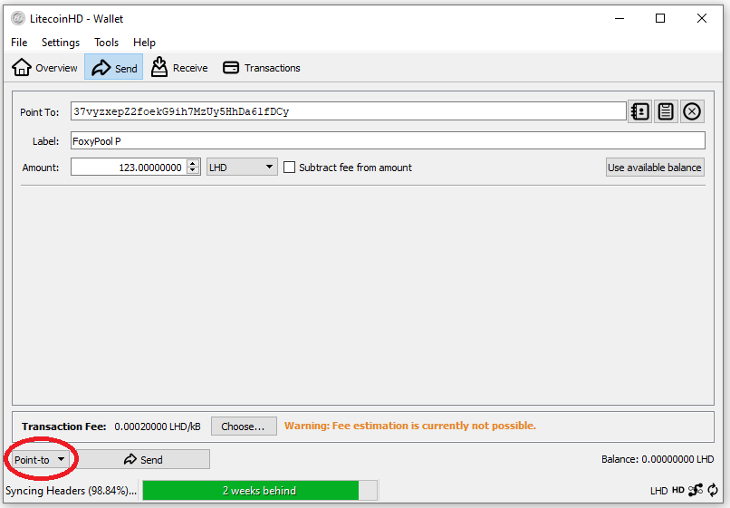

### To pledge to the LHD Foxy-Pool just follow these steps:

1. Open your LHD wallet and let it sync till it is on the current
   height.
2. Change into the tab `Send` and select `Point to`:

    {: loading=lazy }

3. Enter the pools address into the `Point To` field.
4. Enter the amount you wish to pledge in the `Amount` field.
5. Press the `Send` button.
