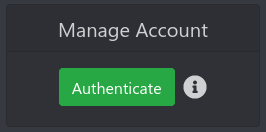

!!! info
    Authenticating allows you to change your name and increase the minimum payout as well as leaving and rejoining the pool.

From your [My Farmer](https://chia-og.foxypool.io/my-farmer){target=_blank} page on the pool you will see a green authentication button.

{ loading=lazy }

Clicking it will open a modal with instructions on what to do next:

1. Change into the directory, where the `chia` binary is located at. When using a git install this is inside the `./activate`-ed repo directory. Otherwise, please use the following:

    === "Windows"
        Open a powershell window and enter the following command:
        ```PowerShell
        cd (Get-Item "$ENV:LOCALAPPDATA\Programs\Chia\resources\app.asar.unpacked\daemon").fullname
        ```

    === "Mac OS"
        Open a terminal and enter the following command:
        ```zsh
        cd /Applications/Chia.app/Contents/Resources/app.asar.unpacked/daemon
        ```

    === "Linux"
        Open a terminal/bash and enter the following command:
        ```bash
        cd /usr/lib/chia-blockchain/resources/app.asar.unpacked/daemon
        ```

2. Next we need to obtain the fingerprint for the pool public key, by entering the following command into the shell:

    === "Windows"
        ```PowerShell
        .\chia keys show
        ```

    === "Linux & Mac OS"
        ```bash
        ./chia keys show
        ```

    !!! info
        If you have multiple keys please use the fingerprint for the key you used to create your OG plots with.

3. Now we need to sign the data from the modal with our keys, identified by the fingerprint from above. To do so you need to run the following command with both the data to sign and your fingerprint from above substituted:

    === "Windows"
        ```PowerShell
        .\chia keys sign -t "m/12381n/8444n/1n/0n" -d <the data to sign here> -f <your fingerprint here>
        ```

        ??? example
            ```PowerShell
            .\chia keys sign -t "m/12381n/8444n/1n/0n" -d 1632306148 -f 67890123456
            ```

    === "Linux & Mac OS"
        ```bash
        ./chia keys sign -t "m/12381n/8444n/1n/0n" -d <the data to sign here> -f <your fingerprint here>
        ```

        ??? example
            ```bash
            ./chia keys sign -t "m/12381n/8444n/1n/0n" -d 1632306148 -f 67890123456
            ```

    !!! info
        Please note that the data to sign shown in the modal is updated every time the modal is (re-) opened, as it reflects the current time in seconds.

4. Finally, copy the signature from above into the modal on the pool website. It is important that no excess whitespaces or line breaks are included.

    !!! example
        ```
        a403f2500b96d69cf415480edd437b6d88fdd45723495f4237c85bbecd8f25895eb1b6ea7c09ef7eb7fe71896f0ddca011b854ab8eec044aa794b48f1d7e1244310a1c44ecb3398c91ec1c182d20753fa1c5929bbb4b7457b0427a52a236debc
        ```
