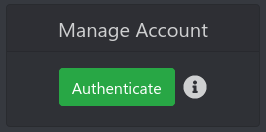

!!! info
    Please note that untrusted members have to accumulate 1.75 XCH in their collateral balance before receiving rewards by the pool to protect the pool against cheaters. When leaving the pool you can claim your collateral balance via the pools web ui.

    Currently, only long known members of the [Foxy Discord](https://discord.gg/gNHhn9y){target=_blank} are trusted, but if such a person knows you very well, he can vouch for you.

## Getting started

!!! warning
    Due to the fact that Foxy-Pool does not know which of your plots are farming on Foxy-Pool and which are farming solo, all plots using the same pool public key need to farm on Foxy-Pool to avoid getting flagged for cheating.

    Also, if you want to farm solo or to some other pool make sure to leave the pool by clicking the "Leave pool" button in the "My Farmer" tab, so you do not get banned for cheating. For more info please see [Leaving the pool](#leaving-the-pool)

!!! info
    The following changes are only necessary for the node running the `farmer` service. If you run the GUI you also run the `farmer` service. As such if you run a multi harvester setup you only need to update the node with the farmer on it, the harvesters can remain as is.

1. To get started farming on [Foxy-Pool CHIA (OG)](https://chia-og.foxypool.io){target=_blank} please download and install the pooling enabled chia-blockchain software from [here](https://github.com/foxypool/chia-blockchain/releases/latest){target=_blank}. The source is available on the `main` branch in case you prefer or require to build from source.
2. Find you chia `config.yaml`:
   
    === "Linux & Mac OS"

        ```bash
        ~/.chia/mainnet/config/config.yaml
        ```
   
    === "Windows"

        ```ps
        C:\Users\<user>\.chia\mainnet\config\config.yaml
        ```

3. Now update your chia `config.yaml` with the following changes:
    - Add the `pool_url` option to the farmer section of the chia `config.yaml` and set it to `https://farmer.chia-og.foxypool.io`. Please note that there must not be a trailing slash present.
    - Add the `pool_payout_address` option to the farmer section of the chia `config.yaml` and set it to your desired chia payout address

    Your `config.yaml` should now look something like this:

    {: loading=lazy }

4. Save the `config.yaml` and (re-)start the pooling enabled chia-blockchain.

## Verify your farmer is working correctly

To verify your farmer is working correctly, please set your log level to `INFO` in your chia `config.yaml` and restart your chia-blockchain software.
If the connection to the pool worked you'll now see a log entry in your chia `debug.log`:
```
Connected to OG pool Foxy-Pool CHIA (OG)
```
Otherwise, you'll see the following info message that pooling is disabled:
```
Not OG pooling as 'pool_payout_address' and/or 'pool_url' are missing in your config
```

Once you submitted your first partial to the pool you can log in to the pool. This can take 1 - 60 minutes, depending on your capacity.

You can search your log for
```
The partial submitted to the OG pool was accepted
```
to check for them.

## Logging in

To see your farmers stats on the [My Farmer](https://chia-og.foxypool.io/my-farmer){target=_blank} tab of the pool you need to log in with the pool public key used by your plots. The pool public key can be found in your chia `config.yaml` in the `pool_public_keys` list or via `chia keys show`.


## Authenticating

It is advisable to authenticate at this stage so you can change Your Name /  Set Min Payout / **Leave Pool**

From your [My Farmer](https://chia-og.foxypool.io/my-farmer){target=_blank} on the pool you will see a green Authenticate Button

{: loading=lazy }

Once you have clicked it you will see a new dialog with 2 commands and instructions on what command you need to run.
 1. Get your fingerprint from first command keys show

    === "Linux & Mac OS"

        ```bash
        cd ~\AppData\Local\chia-blockchain\app*\resources\app.asar.unpacked\daemon\
        then run command
        ./chia keys show
        ```
   
    === "Windows"

        ```ps
        cd (Get-Item "$ENV:LOCALAPPDATA\chia-blockchain\app*\resources\app.asar.unpacked\daemon").fullname
        then run command
        ./chia keys show
        ```
    
    **Then make a note of the fingerprint** that is associated with your plots and PK (incase you have multiple keys for other wallets)

    NOTE: leave the cli open in the current folder as you need it for the next command also

 2. Run the command that the dialog box tells you to run but replace "your fingerprint here" with the one you got from the previous step we will use 1234567
    and "as it shows in dialog" with what it shows in the command then run the full command as its appears

    ```
    ./chia keys sign -t "m/12381/8444/1/0" -d <as it shows in dialog> -f <your fingerprint here>
    ```
Now that you have run the command above you can copy and paste the signature: xxxxxxxxxxxxxxxxxxxxxxxxxxxxxxxxx into the bottom box then hit Authenticate.

You should be back at the Farmer page but now you can see the below

{: loading=lazy }

Now you can set your name that you want to use to show on the dashboards and set the min payout but also leave pool

!!! warning 
    Leave Pool button this must be clicked when you want to leave the pool either permanently or temporary please see the steps below should you wish to leave the pool.


## Leaving the pool

To leave the pool (temporary or permanent) please follow these steps:

1. Visit the [My Farmer](https://chia-og.foxypool.io/my-farmer){target=_blank} tab of the pool, log in and authenticate.
2. Press the "Leave pool" button and confirm whether you want to leave temporary (collateral will remain as is) or permanent (collateral will be paid out):

    {: loading=lazy }

3. Once you have left the pool via the button, shut down your chia-blockchain software and head over to your chia `config.yaml`.
4. In the config remove the `pool_payout_address` and `pool_url` config options you added to the farmer section.
5. **Important**: Change the `xch_target_address` in the pool config section back to one of your addresses so that block rewards are credited to you instead of the pool!
6. Install the official chia-blockchain software.
