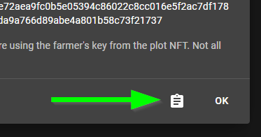

!!! info
    Authenticating allows you to change your name and increase the minimum payout as well as updating your difficulty.

Authentication is done via the built-in login link for pools in the chia-blockchain software:

=== "via the GUI"
    Select the 3 dots at the top right of your PlotNFT and click on "View Pool Login Link":

    {: loading=lazy }

    Then copy the login link by clicking the "Copy" icon at the bottom of the modal:

    {: loading=lazy }

    Finally paste the copied url into your browser and hit enter.

=== "via the CLI"
    First generate the login link via the `get_login_link` command:
    ```bash
    chia plotnft get_login_link --launcher_id <your launcher id here>
    ```

    Then copy the login link, paste it into your browser and hit enter.
