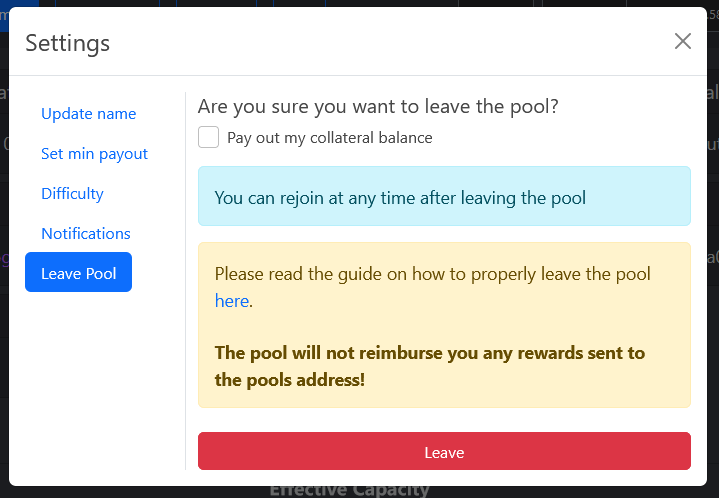

!!! warning
    This pool is shutting down end of March, for more info please see the notice on the pool website or the announcement in discord.

!!! info
    Please note that untrusted members have to accumulate 78.75 XCC in their collateral balance before receiving rewards by the pool to protect the pool against cheaters. When leaving the pool you can claim your collateral balance via the pools web ui.

    Currently, only long known members of the [Foxy Discord](https://discord.gg/gNHhn9y){target=_blank} are trusted, but if such a person knows you very well, he can vouch for you.

## Getting started

!!! warning
    Due to the fact that Foxy-Pool does not know which of your plots are farming on Foxy-Pool and which are farming solo, all plots using the same pool public key need to farm on Foxy-Pool to avoid getting flagged for cheating.

    Also, if you want to farm solo or to some other pool make sure to leave the pool by clicking the "Leave pool" button in the "My Farmer" tab, so you do not get banned for cheating. For more info please see [Leaving the pool](#leaving-the-pool)

!!! info
    The following changes are only necessary for the node running the `farmer` service. If you run the GUI you also run the `farmer` service. As such if you run a multi harvester setup you only need to update the node with the farmer on it, the harvesters can remain as is.

To get started farming on [Foxy-Pool CHIVES (OG)](https://chives-og.foxypool.io){target=_blank} please download and install the pooling enabled chives-blockchain software from [here](https://github.com/foxypool/chives-blockchain/releases/latest){target=_blank}. The source is available on the `main` branch in case you prefer or require to build from source.

## Verify your farmer is working correctly

To verify your farmer is working correctly, please set your log level to `INFO` in your chives `config.yaml` and restart your chives-blockchain software.
If the connection to the pool worked you'll now see a log entry in your chives `debug.log`:
```
Connected to OG pool Foxy-Pool CHIVES (OG)
```

Once you submitted your first partial to the pool you can log in to the pool. This can take 1 - 60 minutes, depending on your capacity.

You can search your log for
```
The partial submitted to the OG pool was accepted
```
to check for them.

## Logging in

To see your farmers stats on the [My Farmer](https://chives-og.foxypool.io/my-farmer){target=_blank} tab of the pool you need to log in with the pool public key used by your plots. The pool public key can be found in your chives `config.yaml` in the `pool_public_keys` list or via `chives keys show`.

It is advisable to authenticate at this stage, so you can change your name, set a minimum payout amount or [leave the pool](#leaving-the-pool). To do so please follow the steps described in [Authenticate](authenticate.md)

## Leaving the pool

To leave the pool (temporary or permanent) please follow these steps:

1. Visit the [My Farmer](https://chives-og.foxypool.io/my-farmer){target=_blank} tab of the pool, log in and authenticate.
2. Press the "Leave pool" button and confirm whether you want to leave temporary (collateral will remain as is) or permanent (collateral will be paid out):

    {: loading=lazy }

3. Once you have left the pool via the button, shut down your chives-blockchain software and head over to your chives `config.yaml`.
4. **Important**: Change the `xcc_target_address` in the pool config section back to one of your addresses so that block rewards are credited to you instead of the pool!
5. Install the official chives-blockchain software.

## Using a pool payout address that differs from your farmer reward address

1. Find your chives `config.yaml`:
   
    === "Linux & Mac OS"

        ```bash
        ~/.chives/mainnet/config/config.yaml
        ```
   
    === "Windows"

        ```ps
        C:\Users\<user>\.chives\mainnet\config\config.yaml
        ```

2. Now add the `pool_payout_address` option to the farmer section of the chives `config.yaml` and set it to your desired chives payout address

3. Save the `config.yaml` and (re-)start the pooling enabled chives-blockchain.
