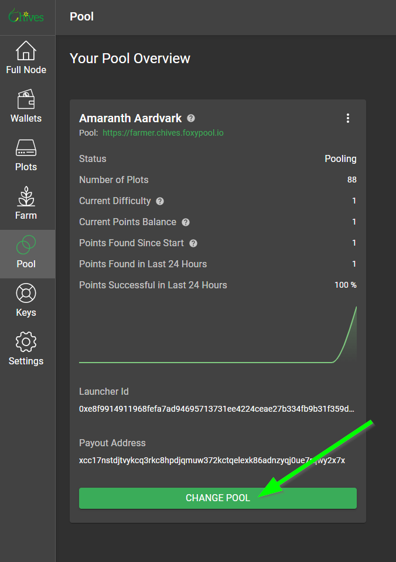
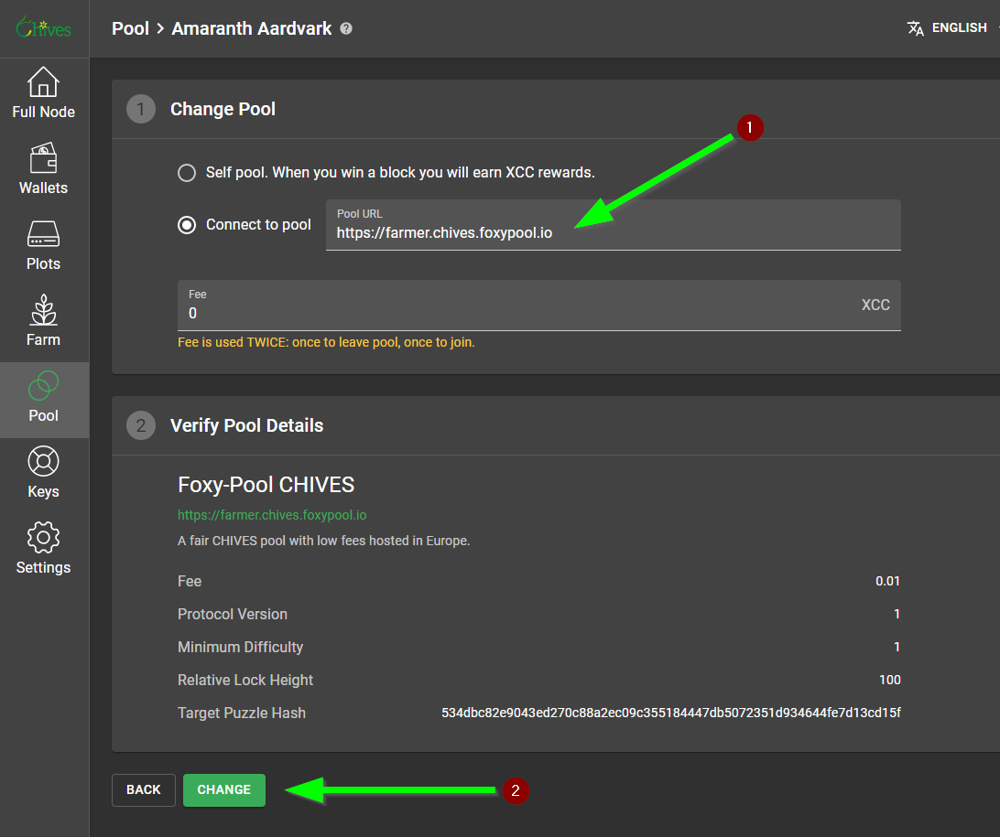

!!! warning
    This pool is shutting down end of March, for more info please see the notice on the pool website or the announcement in discord.

## Getting started

1. To get started farming on [Foxy-Pool CHIVES](https://chives.foxypool.io){target=_blank} please ensure you are using version 1.2.11 or newer of the chives-blockchain software from [here](https://github.com/HiveProject2021/chives-blockchain/releases/latest){target=_blank}. Users also farming OG plots on Foxy can use the og-pooling enabled versions starting from 1.2.11 as well.
2. If you require some coins to create your PlotNFT you can use the [faucet](https://faucet.chivescoin.org){target=_blank} provided by the Chives team.
3. Join the pool with your existing PlotNFT:

    === "via the GUI"
        First click on "Change Pool" to enter a new pool url for your PlotNFT:

        {: loading=lazy }

        Then enter the pools farmer url (`https://farmer.chives.foxypool.io`) and finally click on "Change" at the bottom:

        {: loading=lazy }

    === "via the CLI"
        Use the following command to join the pool. If you have multiple keys you will get asked which key to use.
        ```bash
        chives plotnft join --id 2 --pool_url https://farmer.chives.foxypool.io
        ```

4. Once your PlotNFT switched over to the pool an account is created for your Launcher Id. At this point you can log in to the pools [My Farmer](https://chives.foxypool.io/my-farmer){target=_blank} tab with it, or use the login link generated by your wallet to also [authenticate](authenticate.md).

## Verify your farmer is working correctly

To verify your farmer is working correctly, please check your logs for any pooling errors.
Pooling errors can be found in your chives `debug.log` when searching for `Error in pooling`.
