### So you want to start farming CHIA with your HDD?

#### Preparation

1. First install the CHIA wallet, you can find the latest release [here](https://github.com/Chia-Network/chia-blockchain/releases/latest){target=_blank}.
2. After starting the CHIA wallet for the first time you are prompted to select the wallet mode, select "Farming Mode" here:
   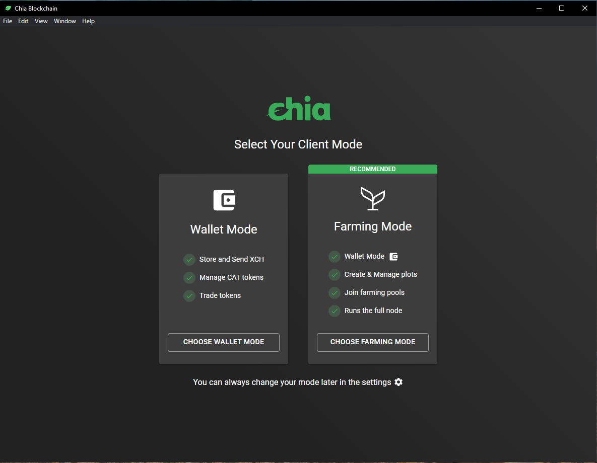{: loading=lazy }

3. Next create a new wallet, this will show you 24 words (your [wallet seed](glossary.md#wallet-seed)) which you need to write down/store safely in a secure location.

    !!! warning "Attention"
        Losing these 24 words means losing your funds! Never share them with anyone!
   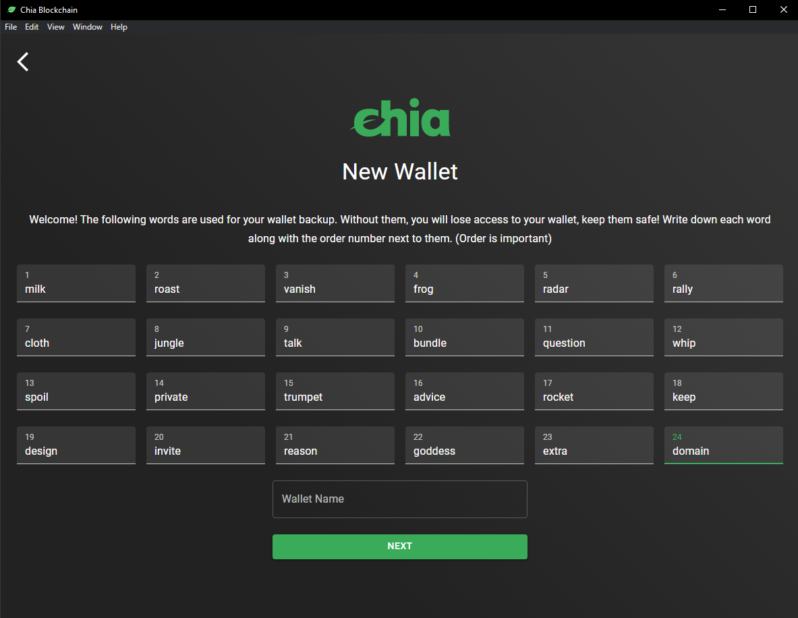{: loading=lazy }

4. Your wallet (full node and wallet service) are now syncing the blockchain:
   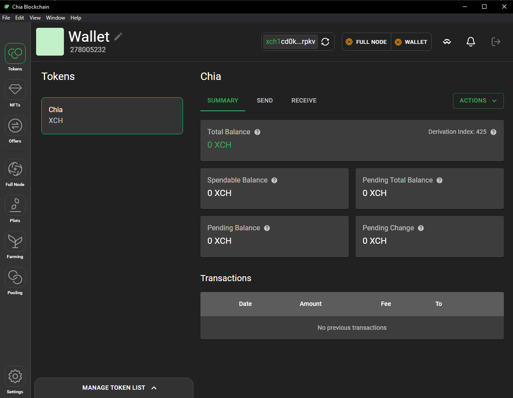{: loading=lazy }

5. (Optional) Speed up syncing by downloading the full node database from a [mirror](https://www.chia.net/downloads/#database-checkpoint){target=_blank}. To do so please stop your chia client, download the database file (`blockchain_v2_mainnet.sqlite`) and overwrite the existing database file located in your chia db directory (for example on Windows: `C:\Users\<User>\.chia\mainnet\db`). Start the chia client again once done.

#### Creating a PlotNFT

1. To create a PlotNFT we first need a tiny bit of XCH, which we can obtain using the [faucet](https://faucet.chia.net){target=_blank} provided by Chia. First copy your XCH receive address by clicking the one shown at the top of the GUI and paste it into the faucet form and hit submit:
   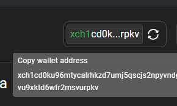{: loading=lazy }
   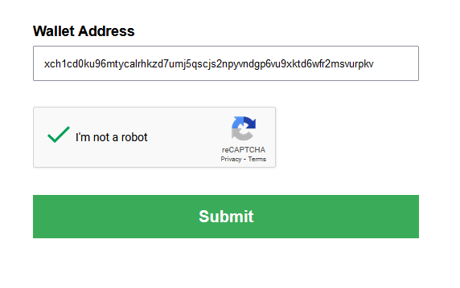{: loading=lazy }

2. Once you see the XCH in your balance it is time to create a PlotNFT by selecting "Pooling" in the sidebar on the left in the Chia GUI and clicking on "Join a Pool":
   {: loading=lazy }

3. Input the pool url `https://farmer.chia.foxypool.io` and hit "Create" at the bottom:
   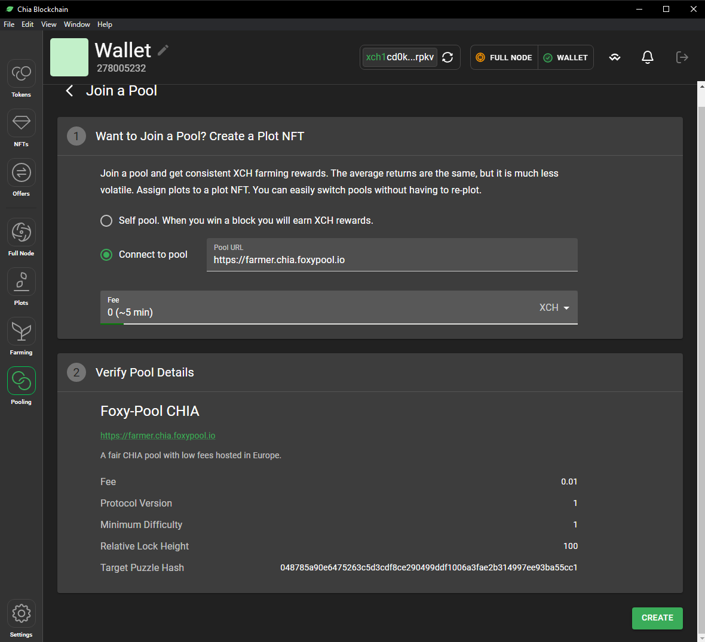{: loading=lazy }

4. Once the PlotNFT is created we can log in to the Pool UI by selecting the 3 dot menu at the top right and clicking on "View Pool Login Link" and opening the link in a browser:
   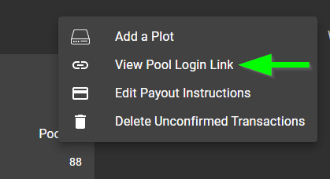{: loading=lazy }

#### Creating the plots

To create the plots you can use the GUI, but for more advanced users using the CLI is recommended. Currently, the GUI does not support creating [compressed plots](glossary.md#compressed-plots).

=== "Using the GUI"
    1. Click on the 3 dot menu of the PlotNFT and select "Add a plot"
    2. Select the madMAx Plotter, input the number of plots to create and select a directory for temporary files during plotting.

        !!! info
            Plotting takes up a bit of temporary space on your SSD, about 270 GB in case of k32. Make sure the temp directory is on a fast drive.
    3. Finally input the directory where you want your plot files to be stored to in the "Final Directory" and hit "Create":
       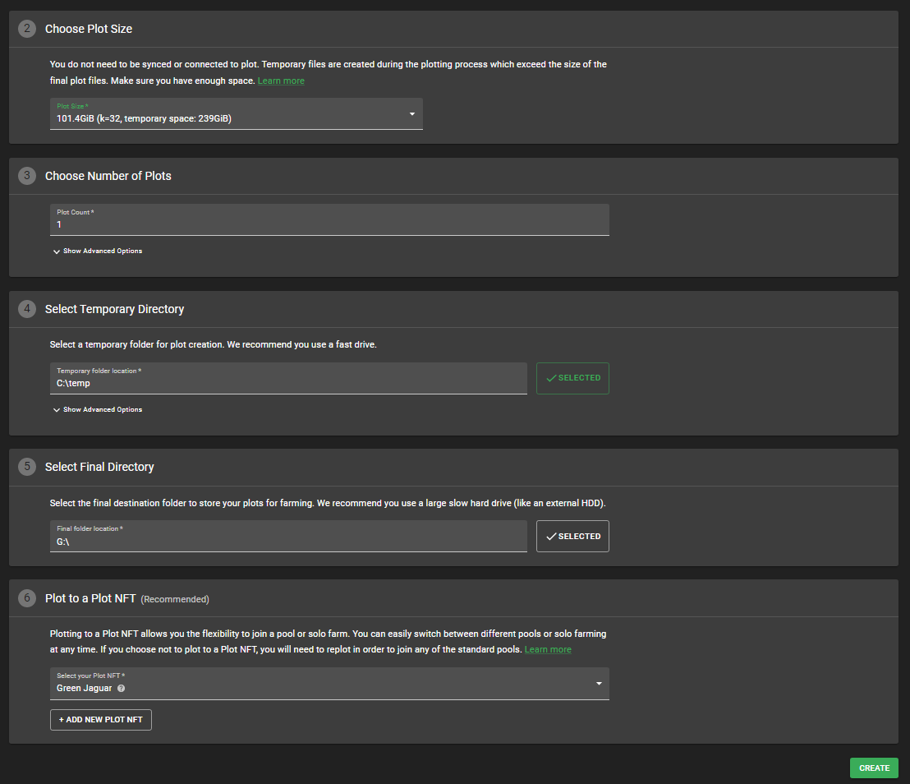{: loading=lazy }
    4. The plotting progress can be observed in the "Plots" tab:
       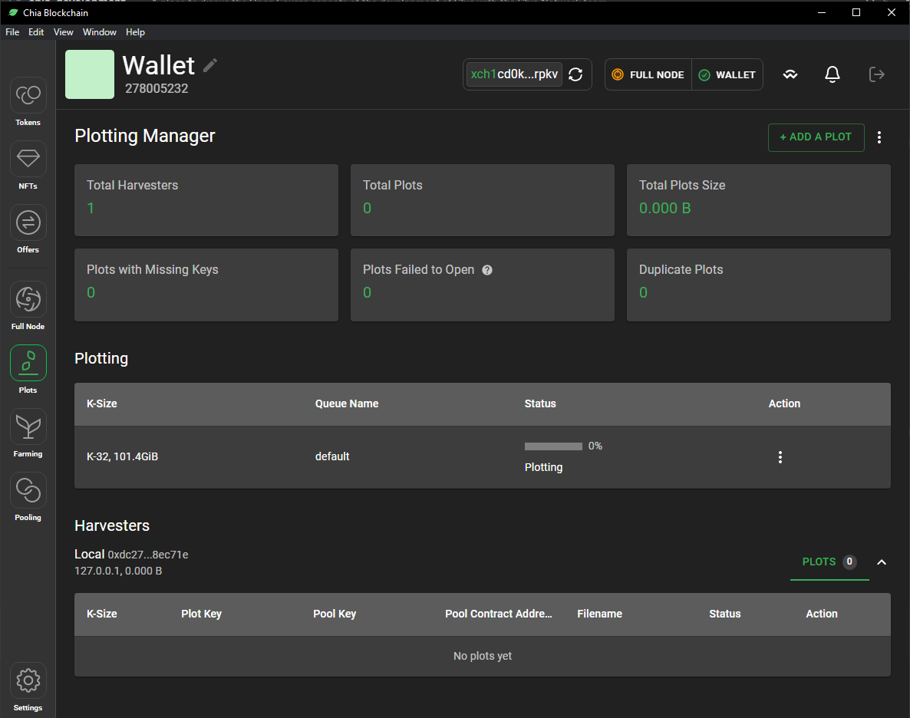{: loading=lazy }

=== "Using the CLI"
    To create any plots in the CLI we first need to extract the Farmer Public Key (FPK) as well as the PlotNFT contract address.

    The FPK can be extracted by first logging out of the wallet at the top right and then selecting "Details" in the 3 dot menu of the key:

    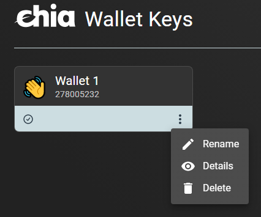{: loading=lazy }
    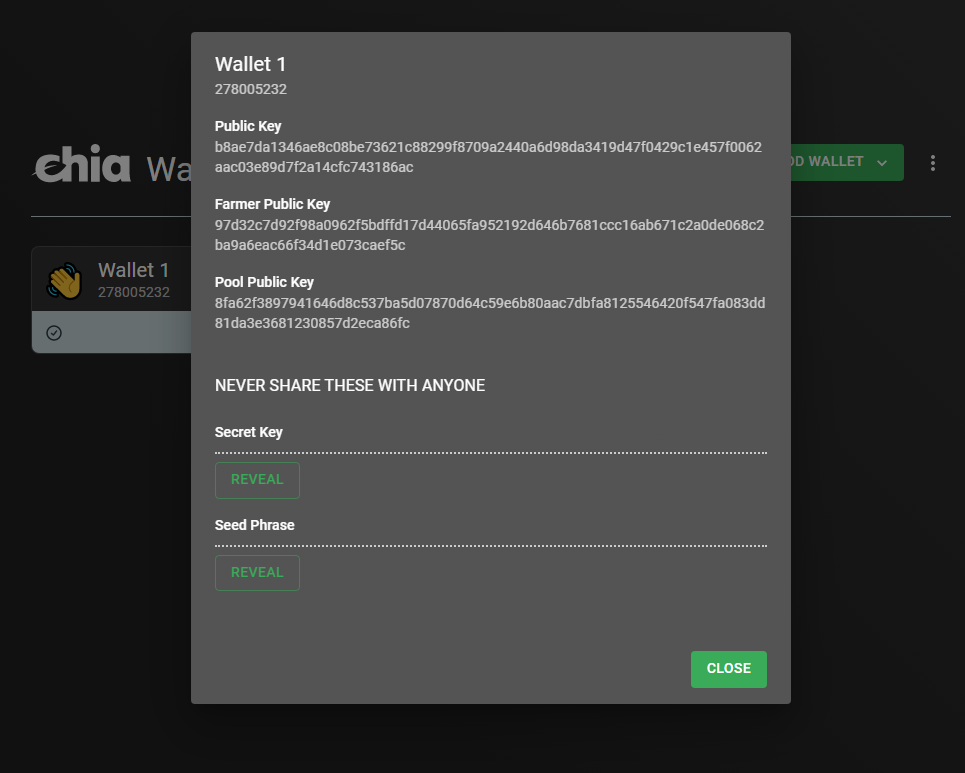{: loading=lazy }

    The PlotNFT contract address can be extracted by hovering over the question mark icon to the right of the PlotNFT name:

    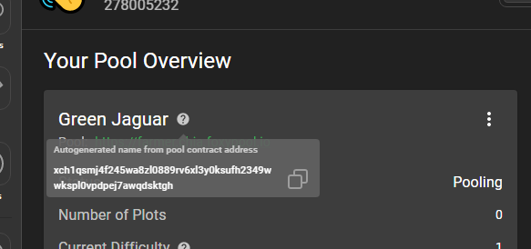{: loading=lazy }

    === "Compressed plots using madMAx (GPU)"
        1. To plot compressed plots using madMAx using your GPU (fast) first download the latest release [here](https://github.com/madMAx43v3r/chia-gigahorse/tree/master/cuda-plotter/windows){target=_blank}.
        2. Open a Powershell window and run the `cuda_plot_k32.exe` with the following arguments:
           ```bash
           -n <number of plots here> -C <compression level here> -S 2 -x 8444 -t <tmp directory here> -d <final directory here> -f <FPK here> -c <PlotNFT contract address here>
           ```

            !!! info
                Run `.\cuda_plot_k32.exe --help` for a detailed list of all supported arguments. See [here](https://github.com/madMAx43v3r/chia-gigahorse#readme){target=_blank} for more detailed infos on Gigahorse.


    === "Compressed plots using madMAx (CPU)"
        1. To plot compressed plots using madMAx using your CPU (slow) first download the latest release [here](https://github.com/madMAx43v3r/chia-gigahorse/tree/master/cpu-plotter/windows){target=_blank}.
        2. Open a Powershell window and run the `chia_plot.exe` with the following arguments:
           ```bash
           -n <number of plots here> -C <compression level here> -x 8444 -t <tmp directory here> -d <final directory here> -f <FPK here> -c <PlotNFT contract address here>
           ```

            !!! info
                Run `.\chia_plot.exe --help` for a detailed list of all supported arguments. See [here](https://github.com/madMAx43v3r/chia-gigahorse#readme){target=_blank} for more detailed infos on Gigahorse.

#### Farming

!!! info
    If you plotted madMAx compressed plots you need to run the Gigahorse full node, farmer and harvester using the CLI and start your regular Chia wallet afterward. Please see [here](https://github.com/madMAx43v3r/chia-gigahorse#readme){target=_blank} for more details.

Once you have created your first plots and your full node is synced you can see them farming in the Farming tab as well as the Pooling tab:
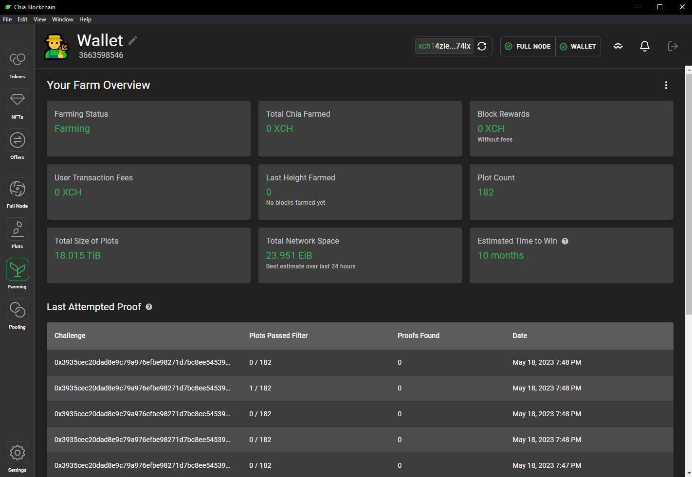{: loading=lazy }
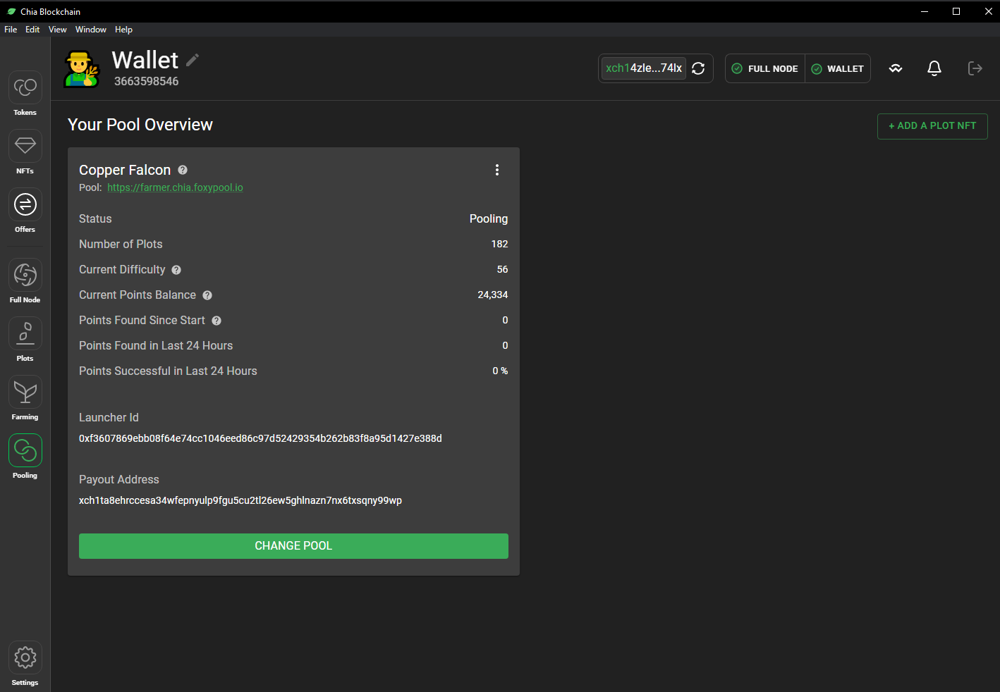{: loading=lazy }

In the pools [My Farmer](https://chia.foxypool.io/my-farmer){target=_blank} tab you can see your farm in detail and keep track of it:
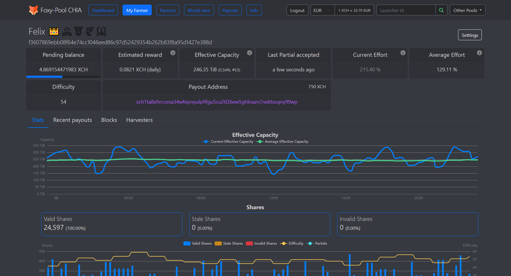{: loading=lazy }

When viewing your Harvesters you can see more fine-grained info corresponding to your harvester(s):
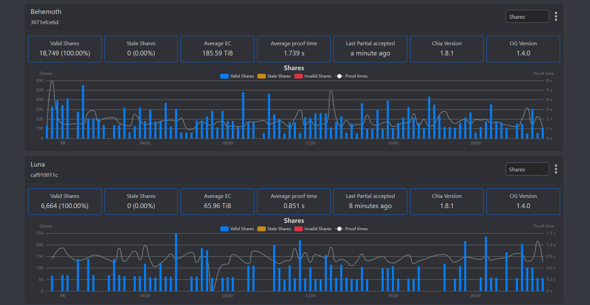{: loading=lazy }
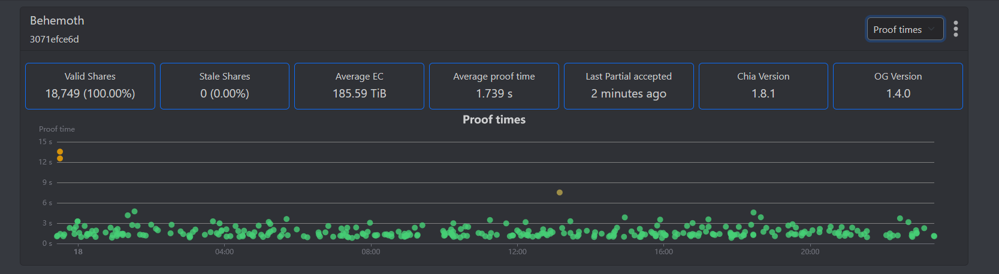{: loading=lazy }

Additionally, you can configure all sorts of settings related to name, payouts, difficulty and notifications by opening the settings:
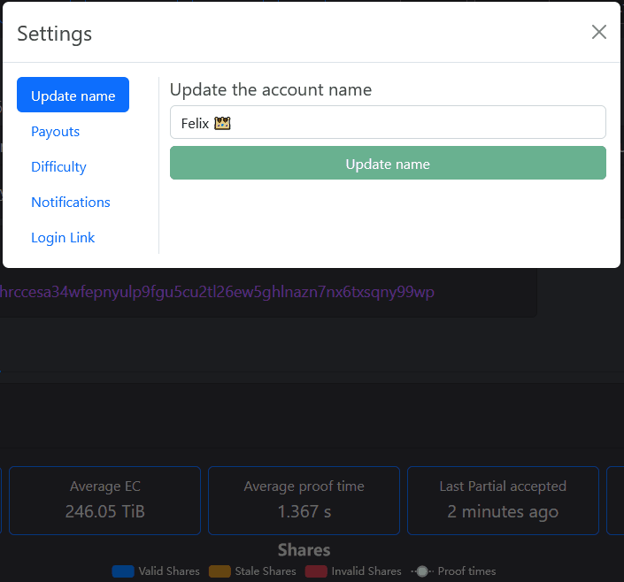{: loading=lazy }

There are lots more things to explore on the Pool UI, just visit [My Farmer](https://chia.foxypool.io/my-farmer){target=_blank} to check them out!

#### More Infos
For a more in detail explanation of all things Chia please see the [official docs](https://docs.chia.net/introduction){target=_blank}.
