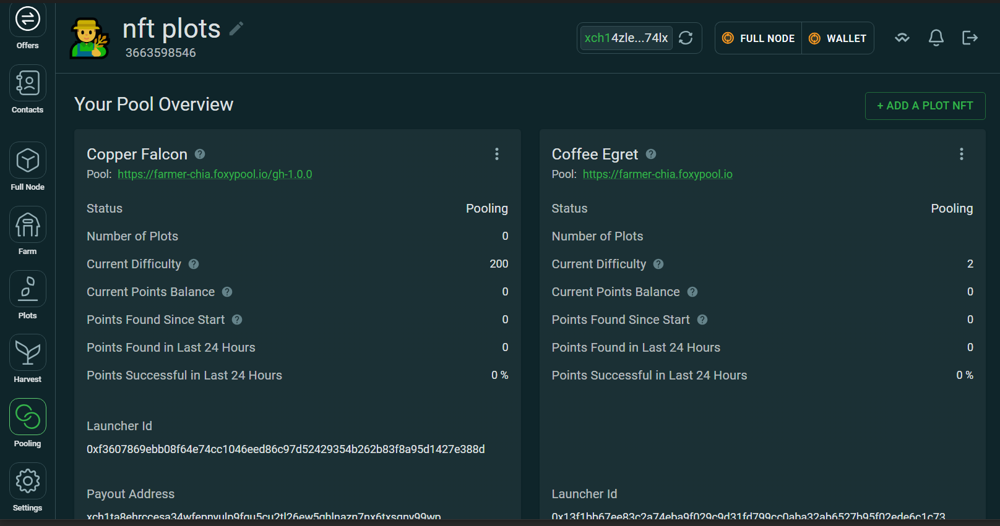
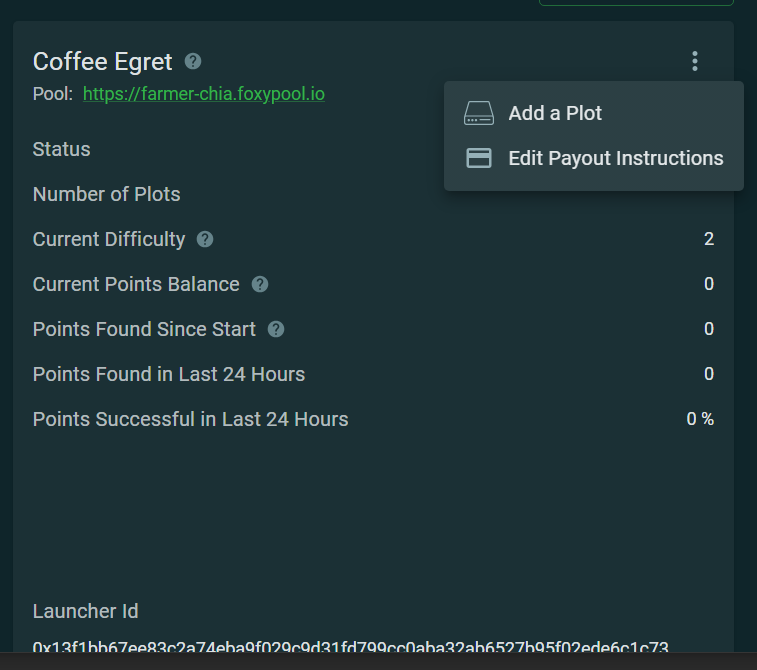
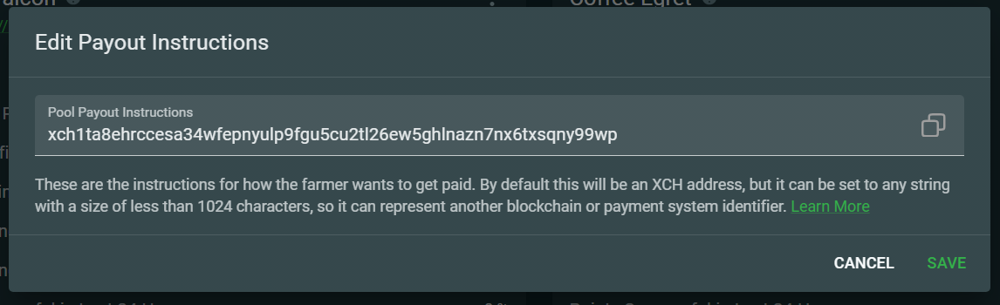

To change the payout address of your PlotNFT follow these steps:

1. Open the "Pooling" tab in the GUI:
   {: loading=lazy }

2. Click on the 3 dot menu at the top right of your PlotNFT and select "Edit Payout Instructions":
   {: loading=lazy }

3. In the modal you can edit your payout address (make sure the same address is configured on all wallets):
   {: loading=lazy }
