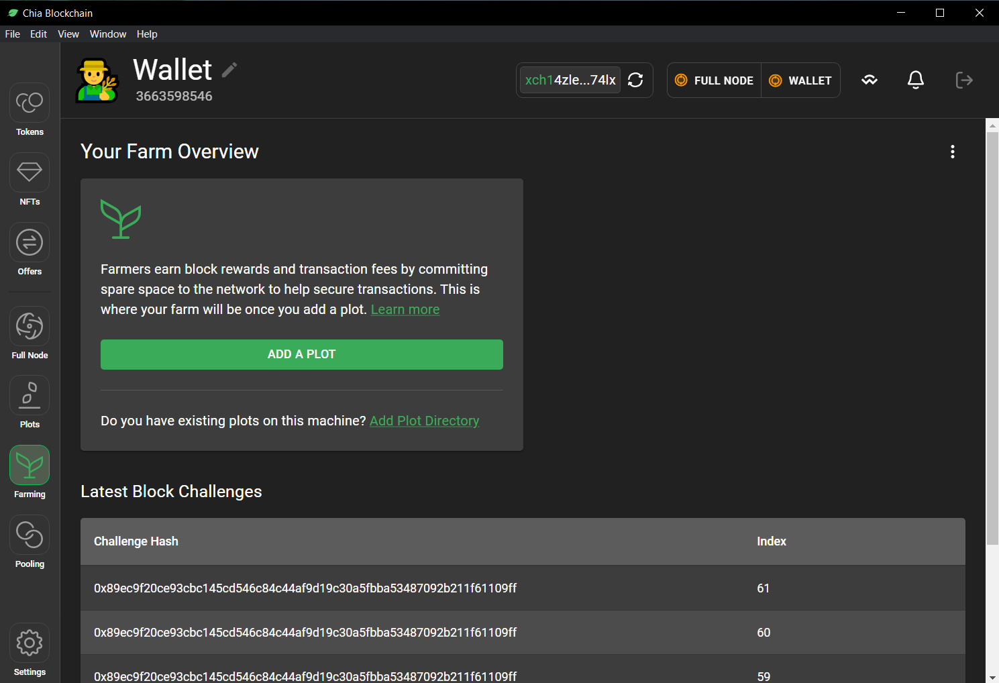
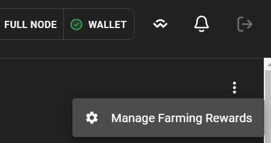
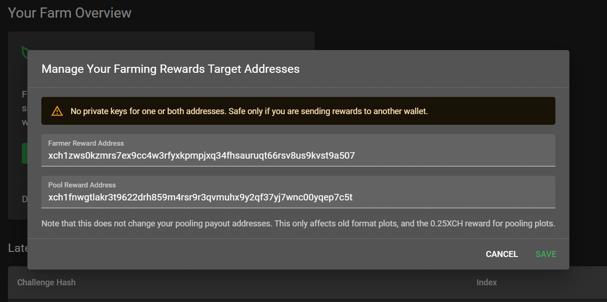

To change the (farmer) reward address follow these steps:

1. Open the "Farming" tab in the GUI:
   {: loading=lazy }

2. Click on the 3 dot menu at the top right and select "Manage Farming Rewards":
   {: loading=lazy }

3. In the modal you can edit your farmer reward address (the address at the top) and pool reward address (the address at the bottom):
   {: loading=lazy }

