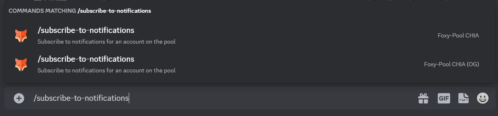
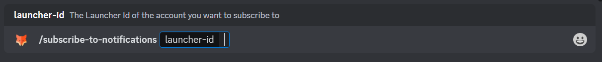
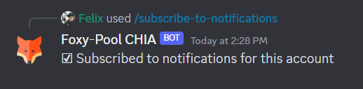
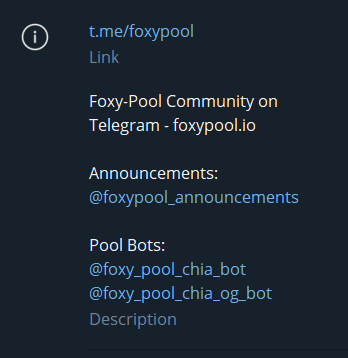
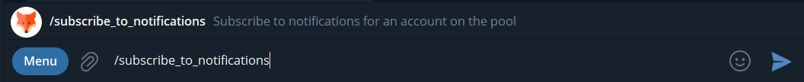
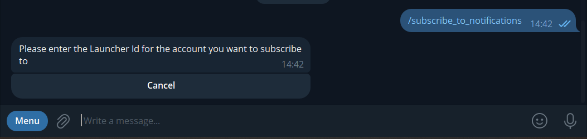
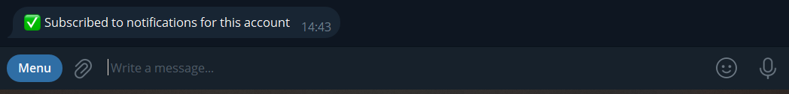

!!! info
    This Guide describes how to subscribe to notifications from the pool(s) using Discord or Telegram. Unsubscribing works the same as subscribing, just replace `subscribe` with `unsubscribe`.

=== "Using Discord"
    
    1. Join the [Foxy Discord](https://discord.gg/foxypool){target=_blank} if you have not done so yet.

        !!! note
            Notification will only work as long as you are a member of the server as the bots are required to share a server with you to send messages to you.

    2. In any channel type `/subscribe-to-notifications` into the message box at the bottom, the available slash commands will show up. Please select the one for the Pool you want to subscribe to:
        {: loading=lazy }
    3. Input the required information, the slash command will show you what it needs, for example for the CHIA pool:
        {: loading=lazy }
    4. After inputting the required information hit enter and the bot will confirm your subscription:
        {: loading=lazy }

=== "Using Telegram"

    1. Join the [Foxy Telegram Group](https://t.me/foxypool){target=_blank} if you have not done so yet.
    2. In the Group's description you can find the handles of the bots:
        {: loading=lazy }
    3. Click on the bot for the pool you want to subscribe to notifications from and click "Start" at the bottom.
    4. Type `/subscribe_to_notifications` into the message box at the bottom, the available slash commands will show up. Confirm with enter.
        {: loading=lazy }
    3. Input the required information, the bot will ask you for the information it needs, for example for the CHIA pool:
        {: loading=lazy }
    4. After inputting the required information hit enter and the bot will confirm your subscription:
        {: loading=lazy }

